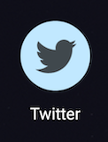

# Twitter shortcut

Normal icon:


Themed icon:



---

Creates an Android app with Twitter icon that redirects to your e𝕏es.

See [releases](https://github.com/ShikaSD/TwitterShortcut/releases) for the prebuilt APK.

Building locally:
```
./gradlew :app:assembleRelease
```